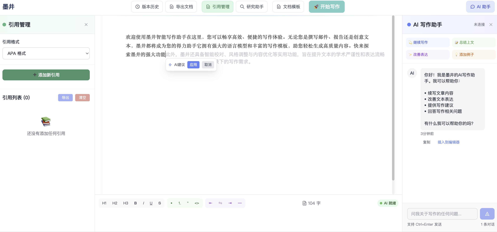

# Inkwell（墨井）智能写作助手

Inkwell（墨井）是一个简化版智能写作助手

## 功能特点

- **智能文本补全**：基于OpenAI API，采用WebSocket + streaming技术实现实时补全
- **结构化写作辅助**：自动生成文章大纲、支持学术论文结构生成
- **引用管理系统**：支持APA/MLA/IEEE/哈佛等格式
- **文本优化功能**：内容改写/扩写/简化
- **多种写作风格调整**：根据需要调整文本风格
- **专业富文本编辑器**：基于Tiptap构建的现代化编辑体验

## 技术栈

- **前端**：Vue 3 + Tailwind CSS
- **后端**：FastAPI
- **编辑器**：Tiptap
- **AI**：OpenAI API
